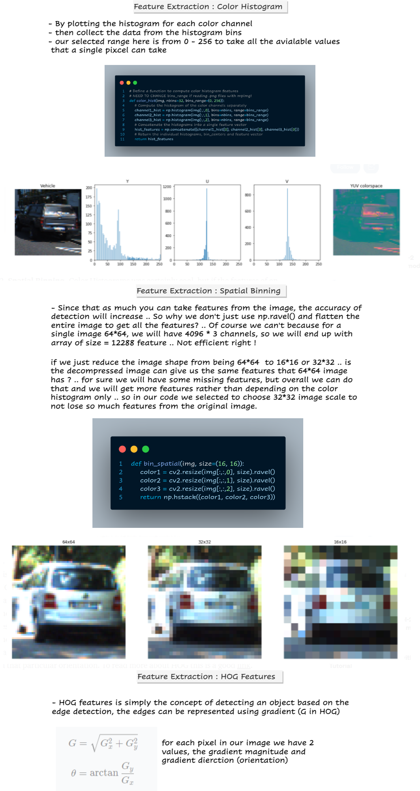
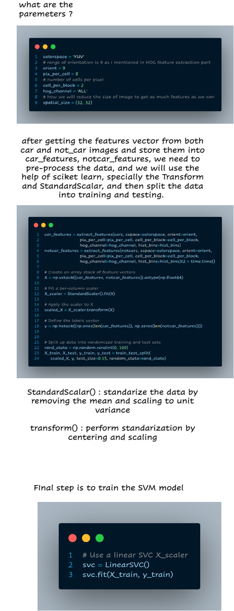
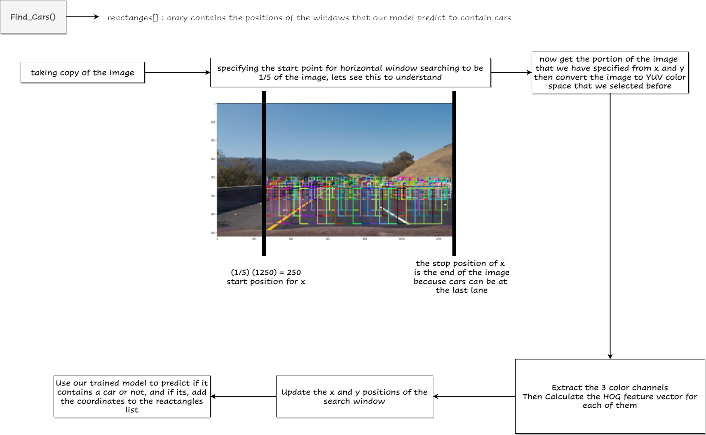
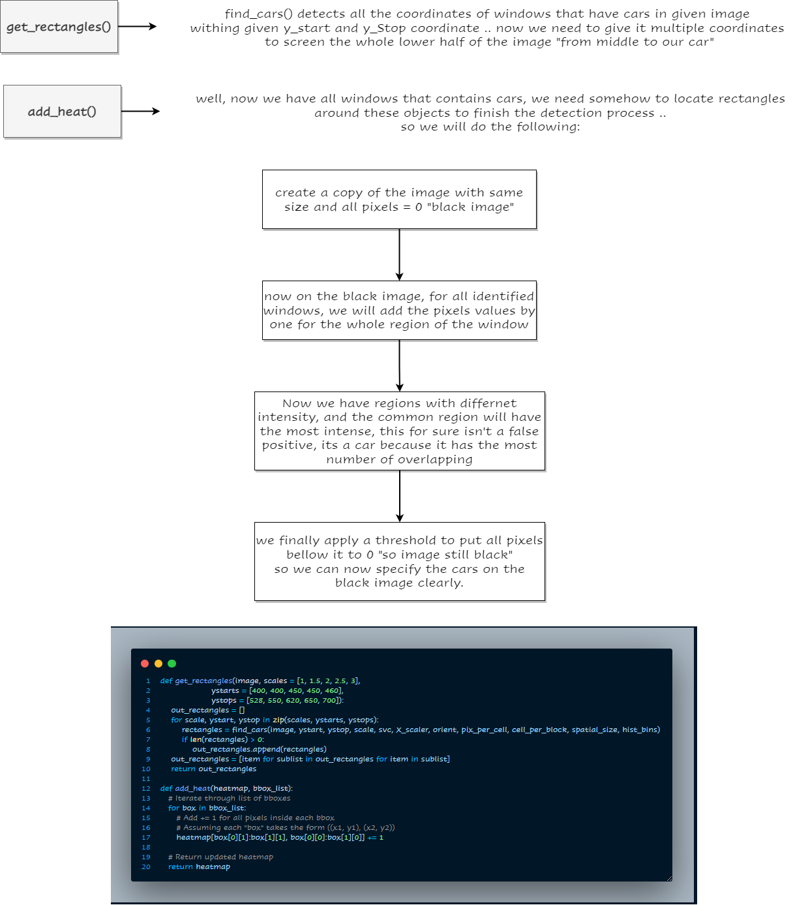

# vehicles-object-detection---computer-vision-project-phase-2

### The output frame we should get:


### The training & Testing phase with our classification model


### Preparing our features vector for model training


### Explanation of our code
##### Feature Extraction:


##### Data Processing


##### Finding and detecting cars


##### Get Reactangle method



 # To Run the pipeline
 - There are 2 modes (0 or 1) 
     * 0 : the output will be the final video only
     * 1 : the output will be the final video and each step the video will pass on it (Debugging mode)
 - Windows 
    * In the terminal (cmd):
        ``` 
          python main.py 0 INPUT_VIDEO_PATH OUTPUT_VIDEO_PATH
          python main.py 1 INPUT_VIDEO_PATH OUTPUT_VIDEO_PATH
        ```
    * if you want to run in shell script => you must run on Git Bash terminal
        ``` 
          sh script.sh 0 INPUT_VIDEO_PATH OUTPUT_VIDEO_PATH
          sh script.sh 1 INPUT_VIDEO_PATH OUTPUT_VIDEO_PATH
        ```
