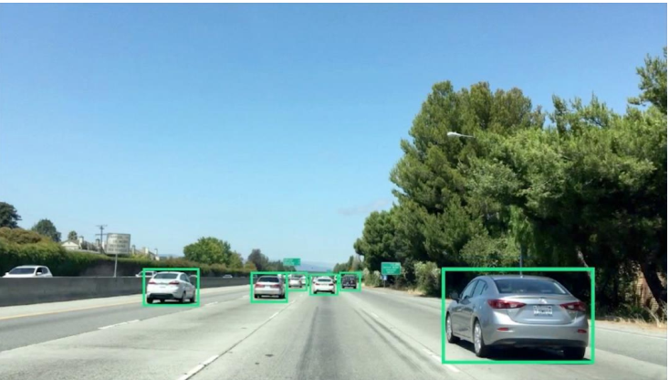
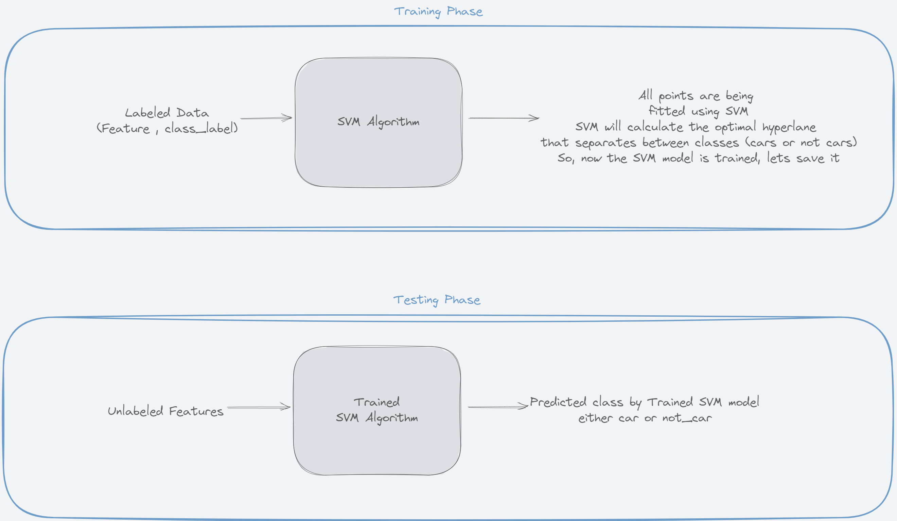
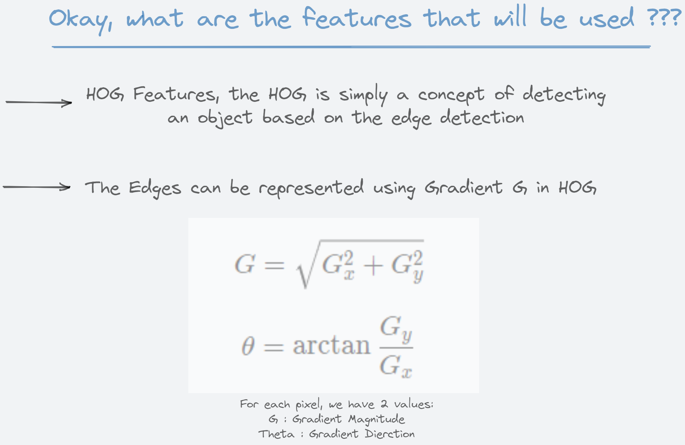
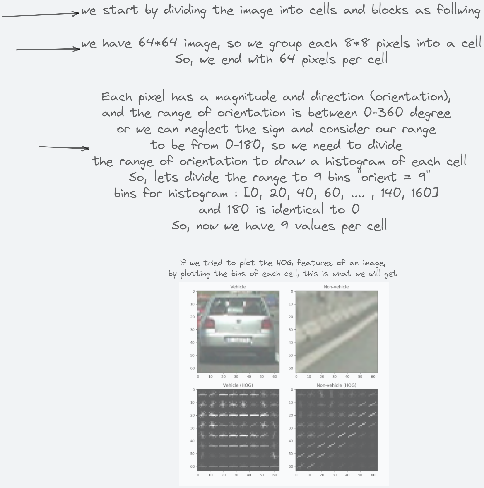
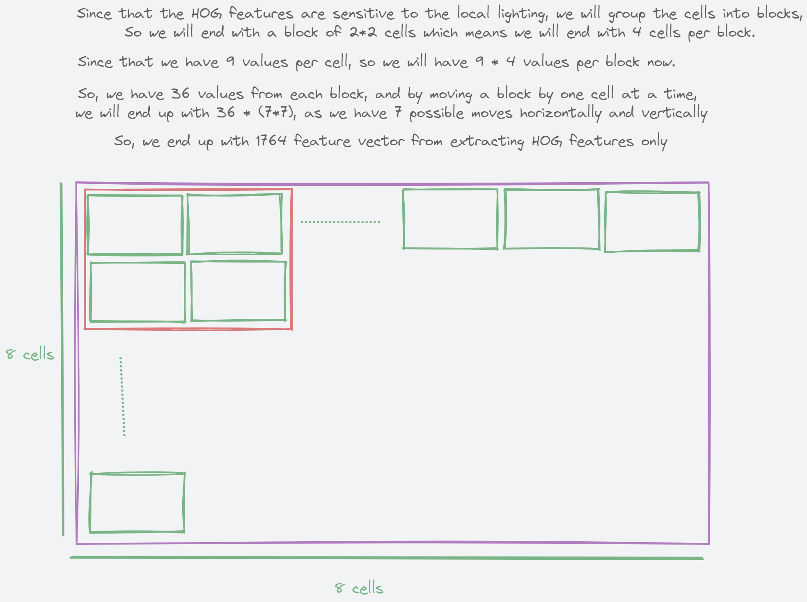
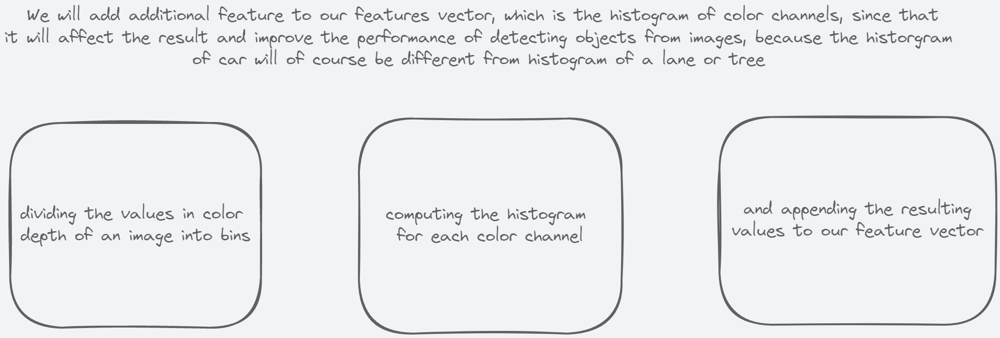

# vehicles-object-detection---computer-vision-project-phase-2

### The output frame we should get:

### The training & Testing phase with our classification model

### Preparing our features vector for model training

